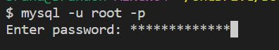
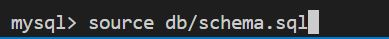
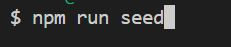
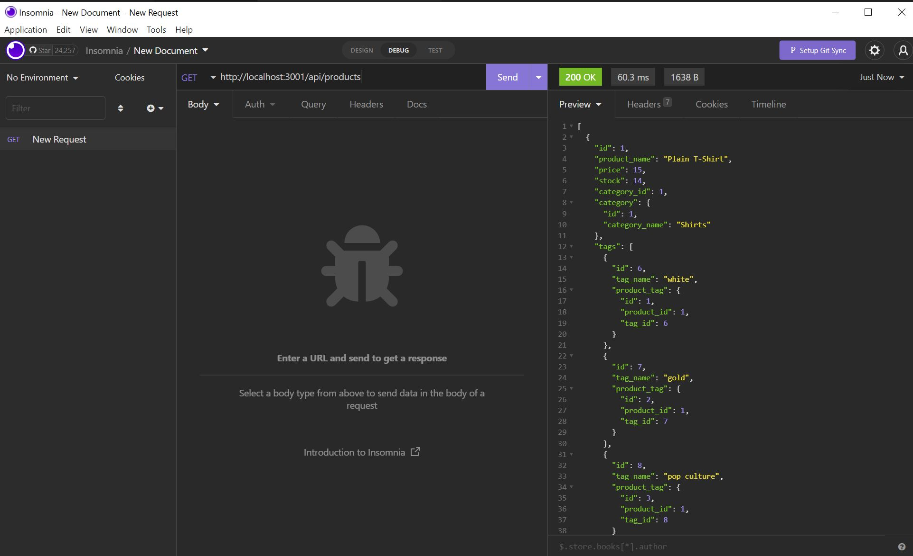
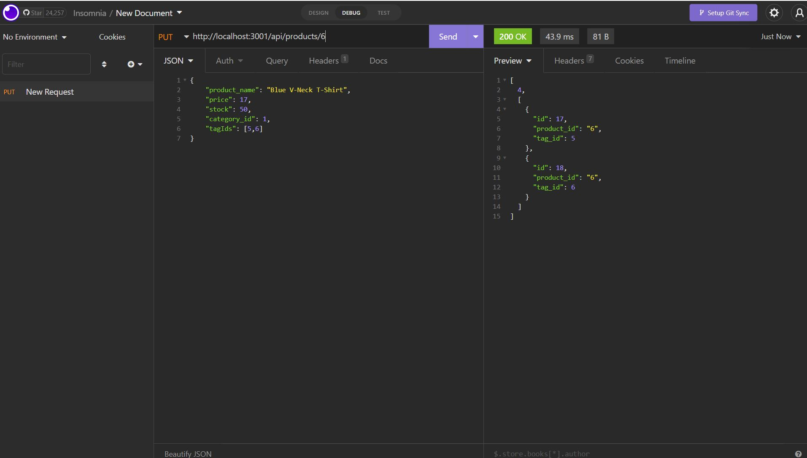
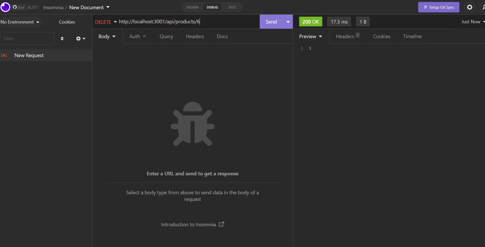

# E-Commerce-Back-End

## Description

- This is an e-commerce backend that shows how a typical simple backend for an e-commerce looks like.
- This backend application utilizes Sequalize to communicate with the MySQL database.
- Users are allowed to view, add, update, and delete categories, products, and product tags.

## Table of content

- [Installation](#installation)
- [Usage](#usage)
- [Credits](#credits)
- [License](#license)

## Installation

- First, in the terminal, run the command "npm install" to install all neccessary packages.
- Log into your MySQL database and initialize the database.

  
  

- Open up another terminal, run the command "npm run seed" to populate seed data.

  

- In the terminal, run the command "npm start" to start the backend server.

  

## Usage

- Link to the demo video: [https://app.castify.com/view/e098eff0-fc28-4090-b0b2-df4132377740](https://app.castify.com/view/e098eff0-fc28-4090-b0b2-df4132377740)
- Link to Github Repo: [https://github.com/BranBao1995/E-Commerce-Back-End](https://github.com/BranBao1995/E-Commerce-Back-End)
- After starting the backend server, open Insomnia and make different requests to test the functionality of the application.
- To demonstrate GET, POST, PUT, and DELETE requests, we will use the /api/products endpoint as an exmaple.
- GET request:

  

- POST request:

  

- PUT request:

  

- DELETE request:

  

## Credits

- Author's Github Profile: [https://github.com/BranBao1995](https://github.com/BranBao1995)

## License 

The MIT License

Copyright (c) [2022] [Hongdong Bao]

Permission is hereby granted, free of charge, to any person obtaining a copy
of this software and associated documentation files (the "Software"), to deal
in the Software without restriction, including without limitation the rights
to use, copy, modify, merge, publish, distribute, sublicense, and/or sell
copies of the Software, and to permit persons to whom the Software is
furnished to do so, subject to the following conditions:

The above copyright notice and this permission notice shall be included in all
copies or substantial portions of the Software.

THE SOFTWARE IS PROVIDED "AS IS", WITHOUT WARRANTY OF ANY KIND, EXPRESS OR
IMPLIED, INCLUDING BUT NOT LIMITED TO THE WARRANTIES OF MERCHANTABILITY,
FITNESS FOR A PARTICULAR PURPOSE AND NONINFRINGEMENT. IN NO EVENT SHALL THE
AUTHORS OR COPYRIGHT HOLDERS BE LIABLE FOR ANY CLAIM, DAMAGES OR OTHER
LIABILITY, WHETHER IN AN ACTION OF CONTRACT, TORT OR OTHERWISE, ARISING FROM,
OUT OF OR IN CONNECTION WITH THE SOFTWARE OR THE USE OR OTHER DEALINGS IN THE
SOFTWARE.
